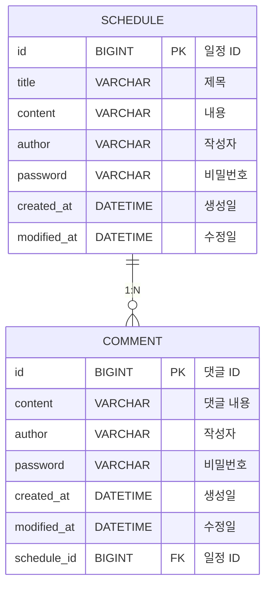

# 📅 ScheduleManagement

---

## API 명세서

### 일정 생성 (POST)

<details> <summary> 명세서 </summary>

일정을 생성하는 API 입니다.

```
POST /api/schedules
```

---

#### Request Header

```
Content-Type: application/json
```

| 이름           | 데이터타입            | 설명        |
|:-------------|:-----------------|:----------|
| Content-Type | application/json | 요청 데이터 형식 |

#### Request Body

```json
{
    "title": "회의",
    "content": "팀 회의 진행",
    "author": "홍길동",
    "password": "1234"
}
```

| 이름       | 데이터타입  | 설명    |
|:---------|:-------|:------|
| title    | String | 일정 제목 |
| content  | String | 일정 내용 |
| author   | String | 작성자명  |
| password | String | 비밀번호  |

---

#### Response Header

```
Content-Type: application/json
```

| 이름           | 데이터타입            | 설명        |
|:-------------|:-----------------|:----------|
| Content-Type | application/json | 응답 데이터 형식 |

#### Response Body
✅ 201 Created
```json
{
    "id": 1,
    "title": "회의",
    "content": "팀 회의 진행",
    "author": "홍길동",
    "createdAt": "2026-04-08T20:00",
    "modifiedAt": "2026-04-08T20:00"
}
```

| 이름         | 데이터타입    | 설명    |
|:-----------|:---------|:------|
| id         | Long     | 일정 id |
| title      | String   | 일정 제목 |
| content    | String   | 일정 내용 |
| author     | String   | 작성자명  |
| createdAt  | DateTime | 생성일   |
| modifiedAt  | DateTime | 수정일   |

</details>

---

### 전체 일정 조회 (GET)

<details><summary> 명세서 </summary>

특정 작성자의 일정 또는 전체 일정을 조회하는 API 입니다.

```
GET /api/schedules
```

---

#### Parameter & Querystring

```
Query Parameter: author (optional)
```

| 이름     | 데이터타입  | 설명               |
|:-------|:-------|:-----------------|
| author | String | 작성자명 (없으면 전체 조회) |

---

#### Response Header

```
Content-Type: application/json
```

| 이름           | 데이터타입            | 설명        |
|:-------------|:-----------------|:----------|
| Content-Type | application/json | 응답 데이터 형식 |

#### Response Body

```json
[
  {
    "id": 1,
    "title": "회의",
    "content": "팀 회의 진행",
    "author": "홍길동",
    "createdAt": "2026-04-08T20:00",
    "modifiedAt": "2026-04-09T00:00"
  },
  {
    "id": 2,
    "title": "강의",
    "content": "강의 수강",
    "author": "홍길동",
    "createdAt": "2026-04-08T22:00",
    "modifiedAt": "2026-04-08T23:00"
  }
]
```

| 이름         | 데이터타입    | 설명    |
|:-----------|:---------|:------|
| id         | Long     | 일정 id |
| title      | String   | 일정 제목 |
| content    | String   | 일정 내용 |
| author     | String   | 작성자명  |
| createdAt  | DateTime | 생성일   |
| modifiedAt | DateTime | 수정일   |

</details>

---

### 선택 일정 조회 (GET)

<details><summary> 명세서 </summary>

특정 번호의 일정을 조회하는 API 입니다.

```
GET /api/schedules/{id}
```

---

#### Parameter & Querystring

```
Path Variable: id
```

| 이름 | 데이터타입 | 설명    |
|:---|:------|:------|
| id | Long  | 일정 id |

---

#### Response Header

```
Content-Type: application/json
```

| 이름           | 데이터타입            | 설명        |
|:-------------|:-----------------|:----------|
| Content-Type | application/json | 응답 데이터 형식 |

#### Response Body

```json
{
  "id": 1,
  "title": "회의",
  "content": "팀 회의 진행",
  "author": "홍길동",
  "createdAt": "2026-04-08T20:00",
  "modifiedAt": "2026-04-09T00:00"
}
```

| 이름         | 데이터타입    | 설명    |
|:-----------|:---------|:------|
| id         | Long     | 일정 id |
| title      | String   | 일정 제목 |
| content    | String   | 일정 내용 |
| author     | String   | 작성자명  |
| createdAt  | DateTime | 생성일   |
| modifiedAt | DateTime | 수정일   |

</details>

---

### 일정 수정 (PATCH)

<details><summary> 명세서 </summary>

특정 번호의 일정을 수정하는 API 입니다.

```
PATCH /api/schedules/{id}
```

---

#### Parameter & Querystring

```
Path Variable: id
```

| 이름 | 데이터타입 | 설명        |
|:---|:------|:----------|
| id | Long  | 수정할 일정 id |

---

#### Request Header

```
Content-Type: application/json
```

| 이름           | 데이터타입            | 설명        |
|:-------------|:-----------------|:----------|
| Content-Type | application/json | 요청 데이터 형식 |

#### Request Body

```json
{
  "title": "팀 회의",
  "author": "홍길동",
  "password": "1234"
}
```

| 이름       | 데이터타입  | 설명        |
|:---------|:-------|:----------|
| title    | String | 수정할 일정 제목 |
| author   | String | 수정할 작성자명  |
| password | String | 검증용 비밀번호  |

---

#### Response Header

```
Content-Type: application/json
```

| 이름           | 데이터타입            | 설명        |
|:-------------|:-----------------|:----------|
| Content-Type | application/json | 응답 데이터 형식 |

#### Response Body

```json
{
    "id": 1,
    "title": "팀 회의",
    "content": "팀 회의 진행",
    "author": "홍길동",
    "createdAt": "2026-04-08T20:00",
    "modifiedAt": "2026-04-09T01:00"
  }
```

| 이름         | 데이터타입    | 설명    |
|:-----------|:---------|:------|
| id         | Long     | 일정 id |
| title      | String   | 일정 제목 |
| content    | String   | 일정 내용 |
| author     | String   | 작성자명  |
| createdAt  | DateTime | 생성일   |
| modifiedAt | DateTime | 수정일   |

</details>

---

### 일정 삭제 (DELETE)

<details><summary> 명세서 </summary>

특정 일정을 삭제하는 API 입니다.

```
DELETE /api/schedules/{id}
```

---

#### Parameter & Querystring

```
Path Variable: id
```

| 이름 | 데이터타입 | 설명        |
|:---|:------|:----------|
| id | Long  | 삭제할 일정 id |

---

#### Request Header

```
Content-Type: application/json
```

| 이름           | 데이터타입            | 설명        |
|:-------------|:-----------------|:----------|
| Content-Type | application/json | 요청 데이터 형식 |

#### Request Body

```json
{
  "password": "1234"
}
```

| 이름       | 데이터타입  | 설명          |
|:---------|:-------|:------------|
| password | String | 삭제 검증용 비밀번호 |

</details>

---

#### ❌ Error Code

| 오류 코드 | HTTP 상태 코드 | 오류 메시지                      |
|:------|:-----------|:----------------------------|
| 400   | 400        | 잘못된 요청 (요청 데이터 오류, 비밀번호 오류) |
| 404   | 404        | 해당 일정이 존재하지 않음              | 
| 500   | 500        | 서버 내부 오류                    | 

---

## ERD



<details><summary>Schedule Table</summary>

| Column     | Type         | Nullable       | Key | Default | Desc     |
|:-----------|:-------------|:---------------|:----|:--------|:---------|
| id         | BIGINT       | NO             | PK  |         | 일정 고유 id |
| title      | VARCHAR(128) | NO             |     |         | 일정 제목    |
| content    | VARCHAR(255) | NO             |     |         | 일정 내용    |
| author     | VARCHAR(50)  | NO             |     |         | 작성자명     |
| password   | VARCHAR(128) | NO             |     |         | 비밀번호     |
| createdAt  | DATETIME     | NO             |     |         | 생성일      |
| modifiedAt | DATETIME     | NO             |     |         | 수정일      |

</details>

<details><summary>Comment Table</summary>

| Column      | Type         | Nullable | Key | Default | Desc     |
|:------------|:-------------|:---------|:----|:--------|:---------|
| id          | BIGINT       | NO       | PK  |         | 댓글 고유 id |
| content     | VARCHAR(255) | NO       |     |         | 댓글 내용    |
| author      | VARCHAR(50)  | NO       |     |         | 작성자명     |
| password    | VARCHAR(128) | NO       |     |         | 비밀번호     |
| createdAt   | DATETIME     | NO       |     |         | 생성일      |
| modifiedAt  | DATETIME     | NO       |     |         | 수정일      |
| schedule_id | BIGINT       | NO       | FK  |         | 일정 id    |

</details>