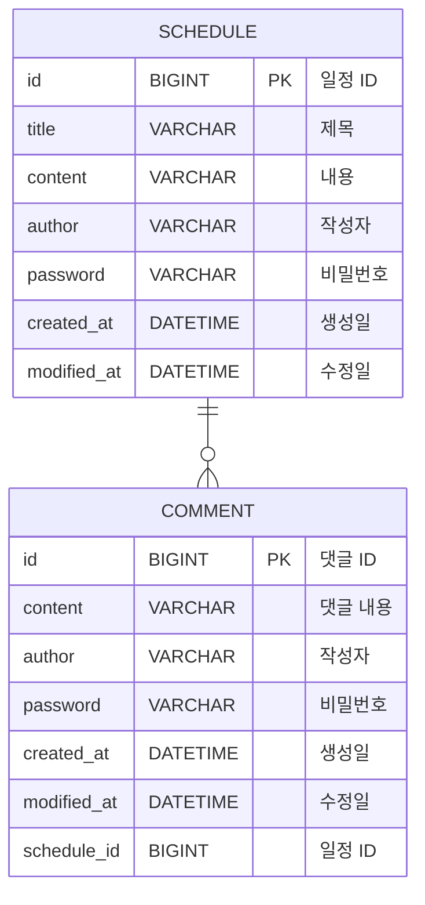

# 📅 ScheduleManagement

Spring Boot 기반의 일정 관리 시스템입니다.

일정 생성, 조회, 수정, 삭제가 가능하고 댓글 등록이 가능합니다.

---

## 🚀 개발 환경

- Language: Java (JDK 17)
- Framework: Spring Boot, Spring Web, Spring Data JPA, Hibernate
- IDE: IntelliJ

---

## 🏗️ 패키지 구조

```
com.schedule
├── controller     # HTTP 요청/응답 처리
├── service        # 비즈니스 로직 처리
├── repository     # DB CRUD 처리
├── entity         # DB 테이블과 매핑되는 Entity
└── dto            # 계층 간 데이터 전달 객체
     ├─ request
     └─ response 
```

---

## 🧩 주요 기능

- 일정 생성
- 일정 조회 - 전체 조회(작성자명 여부는 옵션), 선택 조회(댓글 포함)
- 일정 수정 (비밀번호 검증)
- 일정 삭제 (비밀번호 검증)
- 댓글 등록
- 유저 입력 검증

---

## ⚠️ 예외 처리
### 데이터 없음
- 존재하지 않는 일정 조회 시 NOT_FOUND(404) 반환
###  잘못된 요청
- 유저 입력 검증 실패 시 BAD_REQUEST(400) 반환
### 비밀번호 인증 실패
- 비밀번호가 다른 경우 BAD_REQUEST(400) 반환

---

## 🧾 실행 방법
```
git clone https://github.com/kolyn092/ScheduleManagement.git
./gradlew bootRun
```

---

## 📄 API 명세서

### 일정 생성 (POST)

<details> <summary> 명세서 </summary>

일정을 생성하는 API 입니다.

```
POST /api/schedules
```

---

#### Request Header

```
Content-Type: application/json
```

| 이름           | 데이터타입            | 설명        |
|:-------------|:-----------------|:----------|
| Content-Type | application/json | 요청 데이터 형식 |

#### Request Body

```json
{
  "title" : "회의",
  "content" : "팀 회의 진행",
  "author" : "홍길동",
  "password" : "1234"
}
```

| 이름       | 데이터타입  | 설명    |
|:---------|:-------|:------|
| title    | String | 일정 제목 |
| content  | String | 일정 내용 |
| author   | String | 작성자명  |
| password | String | 비밀번호  |

---

#### Response Header

```
Content-Type: application/json
```

| 이름           | 데이터타입            | 설명        |
|:-------------|:-----------------|:----------|
| Content-Type | application/json | 응답 데이터 형식 |

#### Response Body
✅ 201 Created
```json
{
  "message": "생성 완료",
  "data": {
    "id": 1,
    "title": "회의",
    "content": "팀 회의 진행",
    "author": "홍길동",
    "createdAt": "2026-04-13T14:41:54.425099",
    "modifiedAt": "2026-04-13T14:41:54.425099"
  }
}
```

#### response 구조
| 이름      | 데이터타입  | 설명     |
|:--------|:-------|:-------|
| message | String | 응답 메세지 |
| data    | Object | 응답 데이터 |

#### data 내부 구조
| 이름         | 데이터타입    | 설명    |
|:-----------|:---------|:------|
| id         | Long     | 일정 id |
| title      | String   | 일정 제목 |
| content    | String   | 일정 내용 |
| author     | String   | 작성자명  |
| createdAt  | DateTime | 생성일   |
| modifiedAt  | DateTime | 수정일   |

</details>

---

### 전체 일정 조회 (GET)

<details><summary> 명세서 </summary>

특정 작성자의 일정 또는 전체 일정을 조회하는 API 입니다.

```
GET /api/schedules
```

---

#### Parameter & Querystring

```
Query Parameter: author (optional)
```

| 이름     | 데이터타입  | 설명               |
|:-------|:-------|:-----------------|
| author | String | 작성자명 (없으면 전체 조회) |

---

#### Response Header

```
Content-Type: application/json
```

| 이름           | 데이터타입            | 설명        |
|:-------------|:-----------------|:----------|
| Content-Type | application/json | 응답 데이터 형식 |

#### Response Body
✅ 200 OK
```json
{
  "message": "조회 완료",
  "data": [
    {
      "id": 2,
      "title": "강의",
      "content": "강의 수강",
      "author": "강호동",
      "createdAt": "2026-04-13T14:42:14.147359",
      "modifiedAt": "2026-04-13T14:42:14.147359"
    },
    {
      "id": 1,
      "title": "회의",
      "content": "팀 회의 진행",
      "author": "홍길동",
      "createdAt": "2026-04-13T14:41:54.425099",
      "modifiedAt": "2026-04-13T14:41:54.425099"
    }
  ]
}
```
#### response 구조
| 이름      | 데이터타입  | 설명     |
|:--------|:-------|:-------|
| message | String | 응답 메세지 |
| data    | Array  | 응답 데이터 |

#### data 내부 구조
| 이름         | 데이터타입    | 설명    |
|:-----------|:---------|:------|
| id         | Long     | 일정 id |
| title      | String   | 일정 제목 |
| content    | String   | 일정 내용 |
| author     | String   | 작성자명  |
| createdAt  | DateTime | 생성일   |
| modifiedAt | DateTime | 수정일   |

</details>

---

### 선택 일정 조회 (GET)

<details><summary> 명세서 </summary>

특정 번호의 일정을 조회하는 API 입니다.

```
GET /api/schedules/{id}
```

---

#### Parameter & Querystring

```
Path Variable: id
```

| 이름 | 데이터타입 | 설명    |
|:---|:------|:------|
| id | Long  | 일정 id |

---

#### Response Header

```
Content-Type: application/json
```

| 이름           | 데이터타입            | 설명        |
|:-------------|:-----------------|:----------|
| Content-Type | application/json | 응답 데이터 형식 |

#### Response Body
✅ 200 OK
```json
{
  "message": "조회 완료",
  "data": {
    "id": 1,
    "title": "회의",
    "content": "팀 회의 진행",
    "author": "홍길동",
    "createdAt": "2026-04-13T14:41:54.425099",
    "modifiedAt": "2026-04-13T14:41:54.425099",
    "comments": [
      {
        "id": 1,
        "content": "댓글을 아무지게 적어볼까",
        "author": "홍길동",
        "createdAt": "2026-04-13T14:54:15.430703",
        "modifiedAt": "2026-04-13T14:54:15.430703"
      }
    ]
  }
}
```
#### response 구조
| 이름      | 데이터타입  | 설명     |
|:--------|:-------|:-------|
| message | String | 응답 메세지 |
| data    | Object | 응답 데이터 |

#### data 내부 구조
| 이름         | 데이터타입    | 설명    |
|:-----------|:---------|:------|
| id         | Long     | 일정 id |
| title      | String   | 일정 제목 |
| content    | String   | 일정 내용 |
| author     | String   | 작성자명  |
| createdAt  | DateTime | 생성일   |
| modifiedAt | DateTime | 수정일   |
| comments   | Array    | 댓글 목록 |

#### comments 내부 구조
| 이름         | 데이터타입    | 설명    |
|:-----------|:---------|:------|
| id         | Long     | 댓글 id |
| content    | String   | 댓글 내용 |
| author     | String   | 작성자명  |
| createdAt  | DateTime | 생성일   |
| modifiedAt | DateTime | 수정일   |

</details>

---

### 일정 수정 (PATCH)

<details><summary> 명세서 </summary>

특정 번호의 일정을 수정하는 API 입니다.

```
PATCH /api/schedules/{id}
```

---

#### Parameter & Querystring

```
Path Variable: id
```

| 이름 | 데이터타입 | 설명        |
|:---|:------|:----------|
| id | Long  | 수정할 일정 id |

---

#### Request Header

```
Content-Type: application/json
```

| 이름           | 데이터타입            | 설명        |
|:-------------|:-----------------|:----------|
| Content-Type | application/json | 요청 데이터 형식 |

#### Request Body

```json
{
  "title": "팀 회의 수정",
  "author": "강호동",
  "password": "1234"
}
```

| 이름       | 데이터타입  | 설명        |
|:---------|:-------|:----------|
| title    | String | 수정할 일정 제목 |
| author   | String | 수정할 작성자명  |
| password | String | 검증용 비밀번호  |

---

#### Response Header

```
Content-Type: application/json
```

| 이름           | 데이터타입            | 설명        |
|:-------------|:-----------------|:----------|
| Content-Type | application/json | 응답 데이터 형식 |

#### Response Body
✅ 200 OK
```json
{
  "message": "수정 완료",
  "data": {
    "id": 1,
    "title": "팀 회의 수정",
    "content": "팀 회의 진행",
    "author": "강호동",
    "createdAt": "2026-04-13T14:41:54.425099",
    "modifiedAt": "2026-04-13T15:00:16.7752547"
  }
}
```

#### response 구조
| 이름      | 데이터타입  | 설명     |
|:--------|:-------|:-------|
| message | String | 응답 메세지 |
| data    | Object | 응답 데이터 |

#### data 내부 구조
| 이름         | 데이터타입    | 설명    |
|:-----------|:---------|:------|
| id         | Long     | 일정 id |
| title      | String   | 일정 제목 |
| content    | String   | 일정 내용 |
| author     | String   | 작성자명  |
| createdAt  | DateTime | 생성일   |
| modifiedAt | DateTime | 수정일   |

</details>

---

### 일정 삭제 (DELETE)

<details><summary> 명세서 </summary>

특정 일정을 삭제하는 API 입니다.

```
DELETE /api/schedules/{id}
```

---

#### Parameter & Querystring

```
Path Variable: id
```

| 이름 | 데이터타입 | 설명        |
|:---|:------|:----------|
| id | Long  | 삭제할 일정 id |

---

#### Request Header

```
Content-Type: application/json
```

| 이름           | 데이터타입            | 설명        |
|:-------------|:-----------------|:----------|
| Content-Type | application/json | 요청 데이터 형식 |

#### Request Body

```json
{
  "password": "2345"
}
```

| 이름       | 데이터타입  | 설명          |
|:---------|:-------|:------------|
| password | String | 삭제 검증용 비밀번호 |

#### Response Header

```
Content-Type: application/json
```

| 이름           | 데이터타입            | 설명        |
|:-------------|:-----------------|:----------|
| Content-Type | application/json | 응답 데이터 형식 |

#### Response Body
✅ 200 OK

```json
{
  "message": "삭제 완료",
  "data": null
}
```

#### response 구조
| 이름      | 데이터타입  | 설명           |
|:--------|:-------|:-------------|
| message | String | 응답 메세지       |
| data    | Object | 응답 데이터(null) |

</details>

---

#### ❌ Error Code

| 오류 코드 | HTTP 상태 코드 | 오류 메시지                      |
|:------|:-----------|:----------------------------|
| 400   | 400        | 잘못된 요청 (요청 데이터 오류, 비밀번호 오류) |
| 404   | 404        | 해당 일정이 존재하지 않음              | 
| 500   | 500        | 서버 내부 오류                    | 

<details><summary>example - 400</summary>

```json
{
  "message": "30자 이내로 작성해주세요.",
  "data": null
}
```

```json
{
  "message": "비밀번호가 일치하지 않습니다.",
  "data": null
}
```

</details>
<details><summary>example - 404</summary>

```json
{
    "message": "존재하지 않는 일정입니다.",
    "data": null
}
```

</details>

---

## 🗄️ ERD



<details><summary>Schedule Table</summary>

| Column     | Type         | Nullable       | Key | Default | Desc     |
|:-----------|:-------------|:---------------|:----|:--------|:---------|
| id         | BIGINT       | NO             | PK  |         | 일정 고유 id |
| title      | VARCHAR(128) | NO             |     |         | 일정 제목    |
| content    | VARCHAR(255) | NO             |     |         | 일정 내용    |
| author     | VARCHAR(50)  | NO             |     |         | 작성자명     |
| password   | VARCHAR(128) | NO             |     |         | 비밀번호     |
| createdAt  | DATETIME     | NO             |     |         | 생성일      |
| modifiedAt | DATETIME     | NO             |     |         | 수정일      |

</details>

<details><summary>Comment Table</summary>

| Column      | Type         | Nullable | Key | Default | Desc     |
|:------------|:-------------|:---------|:----|:--------|:---------|
| id          | BIGINT       | NO       | PK  |         | 댓글 고유 id |
| content     | VARCHAR(255) | NO       |     |         | 댓글 내용    |
| author      | VARCHAR(50)  | NO       |     |         | 작성자명     |
| password    | VARCHAR(128) | NO       |     |         | 비밀번호     |
| createdAt   | DATETIME     | NO       |     |         | 생성일      |
| modifiedAt  | DATETIME     | NO       |     |         | 수정일      |
| schedule_id | BIGINT       | NO       | FK  |         | 일정 id    |

</details>

---

1. 3 Layer Architecture(Controller, Service, Repository)의 구조가 왜 필요할까?

     계층을 명확하게 분리하기 때문에 유지보수하거나 확장하기 편해지기 때문이다.
    
2. `@RequestParam`, `@PathVariable`, `@RequestBody`가 각각 어떤 어노테이션이며, 어떤 특징을 갖고 있을까?
    - `@RequestParam` : 쿼리 파라미터를 받기 위해 사용한다.
    - `@PathVariable` : URL 경로에 값을 받기 위해 사용한다.
    - `@RequestBody` : 요청 JSON 데이터를 객체로 변환하는 역할을 한다.
